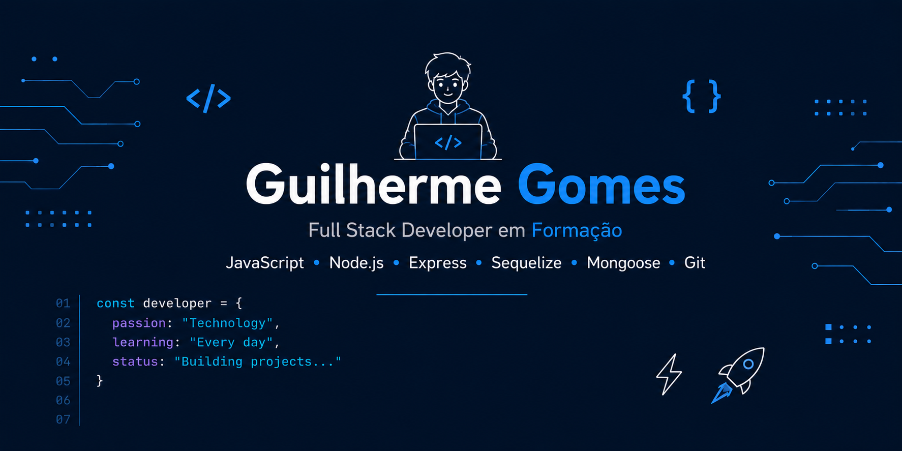

    

---

# Guilherme Gomes

🚀 **Desenvolvedor Full Stack em formação**  
🎯 **Focado em JavaScript, Node.js e Bancos de Dados**

> Aprendendo hoje para construir soluções melhores amanhã.

    
    

---

## Sobre mim

Tenho 17 anos e sou estudante do Ensino Médio integrado ao curso Técnico em Informática. Atualmente estudo desenvolvimento Full Stack por meio de cursos, formações e projetos práticos na Alura.  

Sou apaixonado por tecnologia desde criança e gosto de transformar conhecimento em aplicações reais, buscando sempre aprender novas ferramentas e boas práticas de desenvolvimento.

---

## 🚀 Atualmente

- 📚 Estudando **Node.js**, **Express** e **arquitetura de APIs REST**
- 🗄️ Aprendendo **MongoDB**, **Mongoose** e **Sequelize**
- 🚀 Desenvolvendo aplicações **Full Stack**
- 🌱 Aprofundando conhecimentos em **JavaScript moderno**

---

## ⭐ Projetos em Destaque

🔹 [🎓 Sistema Acadêmico - API REST para gerenciamento de alunos, professores e cursos utilizando Express e Sequelize.](https://github.com/mguilhermegomes/api-rest-faculdade-sqlite)

🔹 [📚 API REST Livraria - Sistema completo para cadastro de livros, autores e editoras utilizando MongoDB e Mongoose.](https://github.com/mguilhermegomes/api-rest-livraria-mongodb)

🔹 [💭 Memoteca - CRUD Front-End completo para gerenciamento de pensamentos em um mural](https://github.com/mguilhermegomes/memoteca)

🔹 [☕ Serenatto Café - Landing Page desenvolvida com SCSS](https://github.com/mguilhermegomes/serenatto-cafe)

---

## 💻 Tecnologias

### Front-end

### Back-end

### Banco de Dados

### Ferramentas

---

## 📊 Estatísticas

    
    &nbsp;&nbsp;
    

    

---

## 📫 Contato

&nbsp;

&nbsp;

---

**⭐ Obrigado por visitar meu perfil!**

> Sempre aprendendo. Sempre construindo.
